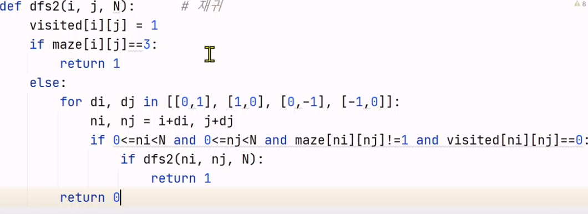
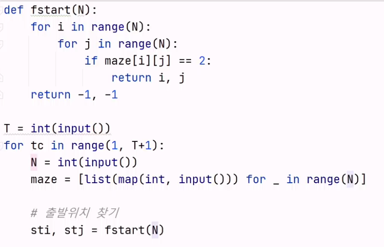

# APS(Algorithm Problem Solving) 기본

## Stack 2

### 계산기1

- 문자열로 된 계산식이 주어질 때, 스택을 이용하여 이 계산식의 값을 계산할 수 있다.
- 문자열 수식 계산의 일반적 방법
  1. step1. 중위 표기법의 수식을 후위 표기법으로 변경한다. (스택 이용)
  - 중위 표기법(infix notation)
    - 연산자를 피연산자의 가운데 표기하는 방법 (A+B)
  - 후위 표기법(postfix notation)
    - 연산자를 피연산자 뒤에 표기하는 방법 (AB+)
  2. step2. 후위 표기법의 수식을 스택을 이용하여 계산한다.

#### step1. 중위 표기식의 후위 표기식 변환 1

- 수식의 각 연산자에 대해서 우선순위에 따라 괄호를 사용하여 다시 표현한다.
- 각 연산자를 그에 대응하는 오른쪽 괄호의 뒤로 이동시킨다.
- 괄호를 제거한다.
   ex> A\*B-C/D
  1. ( (A\*B) - (C/D) )
  2. ( (A B)\* (C D)/ )-
  3. AB\*CD/-

#### step1. 중위 표기식의 후위 표기식 변환 2 - 알고리즘(stack 이용)

1. 입력받은 중위 표기식에서 토큰을 읽는다.
2. 토큰이 피연산자이면 토큰을 출력한다.
3. 토큰이 연산자(괄호포함)일 때, 이 토큰이 스택의 top에 저장되어 있는 연산자보다 우선순위가 높으면 스택에 push하고, 그렇지 않다면 스택 top의 연산자의 우선순위가 토큰의 우선순위보다 작을 때까지 스택에서 pop한 후 토큰의 연산자를 push한다. 만약 top에 연산자가 없으면 push한다.
4. 토큰이 오른쪽 괄호 ')'이면 스택 top에 왼쪽 괄호 '('가 올 때 까지 스택에 pop연산을 수행하고 pop한 연산자를 출력한다. 왼쪽 괄호를 만나면 pop만 하고 출력하지는 않는다.
5. 중위 표기식에 더 읽을 것이 없다면 중지하고, 더 읽을 것이 있다면 1부터 다시 반복한다.
6. 스택에 남아 있는 연산자를 모두 pop하여 출력한다.
   - 스택 밖의 왼쪽 괄호는 우선순위가 가장 높으며, 스택 안의 왼쪽 괄호는 우선 순위가 가장 낮다.

### 백트래킹

- 백트래킹(Backtracking) 기법은 해를 찾는 도중에 '막히면' 되돌아 가서 다시 해를 찾아 가는 기법이다.
- 백트래킹 기법은 최적화 문제와 결정 문제를 해결할 수 있다.
- 결정 문제 : 문제의 조건을 만족하는 해가 존재하는지의 여부를 'yes' 또는 'no'가 답하는 문제
  - 미로찾기
  - n-Queen 문제
  - Map coloring
  - 부분 집합의 합(Subset Sum) 문제 등
- 모든 후보 검사 X

#### 백트래킹과 깊이우선탐색의 차이

- 어떤 노드에서 출발하는 경로가 해결책으로 이어질 것 같지 않으면 더 이상 그 경로 탐색을 하지 않으며 시도의 횟수를 줄인다. (Prunning 가지치기)
- 깊이 우선 탐색 : 모든 경로 추적 / 백트래킹 : 불필요한 경로 조기 차단

#### 기법

- 어떤 노드의 유망성을 점검한 후에 유망하지 않다고 결정되면 그 노드의 부모로 되돌아가 다음 자식노드로 감
- 어떤 노드를 방문했을 때 그 노드를 포함한 경로가 해답이 될 수 없으면 그 노드는 유망하지 않다고 하며, 반대로 해답의 가능성이 있으면 유망하다고 한다.
- 가지치기(prunning) : 유망하지 않는 노드가 포함되는 경로는 더이상 고려 X

#### 절차

1. 상태 공간 트리의 깊이 우선 검색 실시
2. 각 노드가 유망한지 점검
3. 만일 그 노드가 유망하지 않다면, 그 노드의 부모 노드로 돌아가서 검색을 계속한다.
   
   
   
