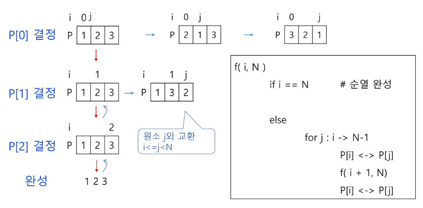

# APS(Algorithm Problem Solving) 기본

## Stack 2

### 부분집합

- 어떤 집합의 공집합과 자기자신을 포함한 모든 부분집합을 powerset이라고 하며 구하고자 하는 어떤 집합의 원소 개수가 n일 경우 부분집합의 개수는 2ⁿ개 이다.
- 백트래킹 기법으로 powerset 만들기
  - 일반적인 백트래킹 접근방법 이용
  - n개의 원소가 들어있는 집합의 2ⁿ개의 부분집합을 만들 때는, true 또는 false값을 가지는 항목들로 구성된 n개의 배열을 만드는 방법을 이용.
  - 여기서 배열의 i번째 항목은 i번째의 원소가 부분집합의 값인지 아닌지를 나타내는 값이다.
    

```py
bit = [0,0,0,0]
for i in range(2):
    bit[0]=i
    for j in range(2):
        bit[1]=j
        for k in range(2):
            bit[2]=k
            for l in range(2):
                bit[3]=l
                print(bit)

for i in range(1<<len(bit)):
    sub=[]
    for j in range(len(bit)):
        if i & (1<<j):
            sub.append(bit[j])
```

```py
# powerset을 구하는 백트래킹 알고리즘
def backtrack(a, k, n): # a 주어진 배열, k 결정할 원소, n 원소 개수
    c=[0]*MAXCANDIDATES

    if k==n:
        process_solution(a,k) # 답이면 원하는 작업
    else:
        ncandidates = construct_candidates(a, k, n, c)
        for i in range(ncandidates):
            a[k] = c[i]
            backtrack(a, k+1, n)

def construct_candidates(a,k,n,c):
    c[0]=True
    c[1]=False
    return 2

def process_solution(a,k):
    for i in range(k):
        if a[i] print(num[i], end = ' ')
    print()
MAXCANDIDATES = 2
NMAX = 4
a = [0] * NMAX
num = [1,2,3,4]
backtrack(a, 0, NMAX)
```

### 순열

```py
#집합 {1,2,3}에서 모든 순열을 생성하는 함수
for i1 in range(1,4):
    for i2 in range(1,4):
        if i2!=i1:
            for i3 in range(1,4):
                if i3!=i1 and i3!=i2:
                    print(i1,i2,i3)
```


```py
# 백트래킹 이용 순열 구하기
def backtrack(a, k, n):
    c=[0]*MAXCANDIDATES

    if k==n:
        for i in range(0, k):
            print(a[i], end=' ')
        print()
    else:
        ncandidates = construct_candidates(a, k, n, c)
        for i in range(ncandidates):
            a[k] = c[i]
            backtrack(a, k+1, n)

def construct_candidates(a, k, n, c):
    in_perm = [False]*(NMAX+1)

    for i in range(k):
        in_perm[a[i]] = True

    ncandidates = 0
    for i in range(1, NMAX+1):
        if in_perm[i] == False:
            c[ncandidates] = i
            ncandidates += 1
    return ncandidates

MAXCANDIDATES = 3
NMAX = 3
a = [0]*NMAX
backtrack(a, 0, 3)
```

### 가지치기

```py
def f(i,k,s,t): #i 원소, k 집합의 크기, s i-1까지 고려된 합, t 목표
    global cnt
    global fcnt
    fcnt+=1
    if s> t:  # 고려한 원소의 합이 찾는 합보다 큰 경우
        return
    elif s==t:  # 남은 원소를 고려할 필요가 없는 경우
        cnt+=1
    if i==k:  # 모든 원소 고려
        return
    else:
        bit[i]=1
        f(i+1, k, s+A[i], t)  # A[i] 포함
        bit[i]=0
        f(i, k, s, t)  # A[i] 미포함

A=[1,2,3,4,5,6,7,8,9,10]
N=10
key=10
cnt=0
bit=[0]*N
fcnt=0
f(0,N,0,key)
print(cnt, fcnt)
```


